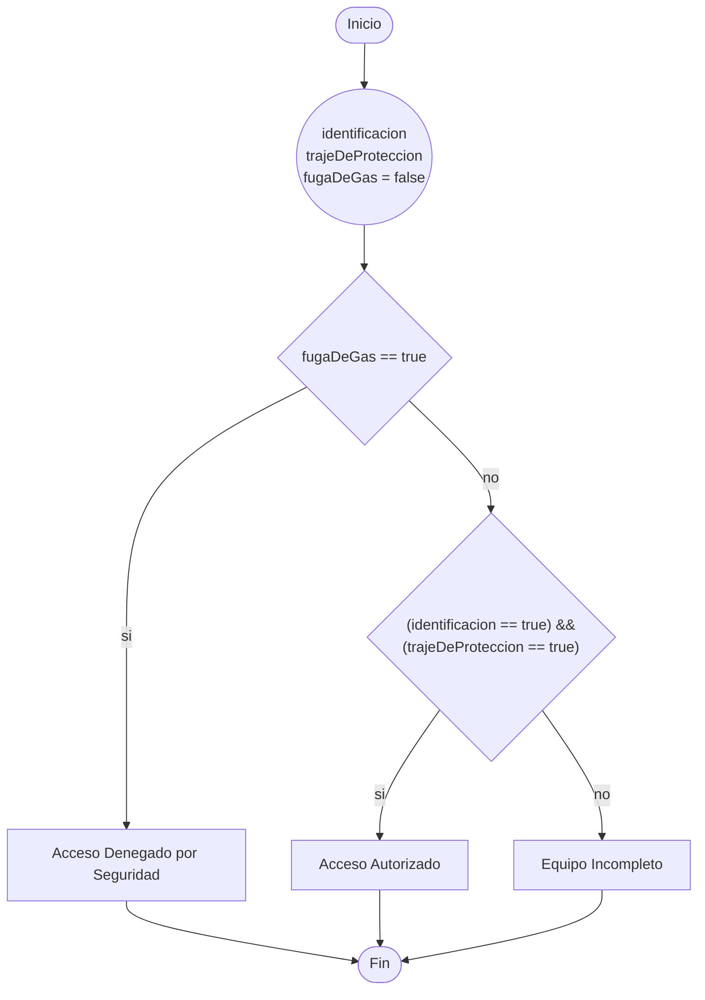

## 🛠️ Solución Propuesta

```mermaid
---

config:
theme: redux-dark

---

graph TD
A([Inicio]) --> B((identificacion <br/> trajeDeProteccion <br/> fugaDeGas = false))

    B --> C{fugaDeGas == true}

    C -- si --> D["Acceso Denegado por Seguridad"]
    C -- no --> E{"(identificacion == true) && <br/> (trajeDeProteccion == true)"}

    E -- si --> F["Acceso Autorizado"]
    E -- no --> G["Equipo Incompleto"]

    D --> H([Fin])
    F --> H
    G --> H
```
