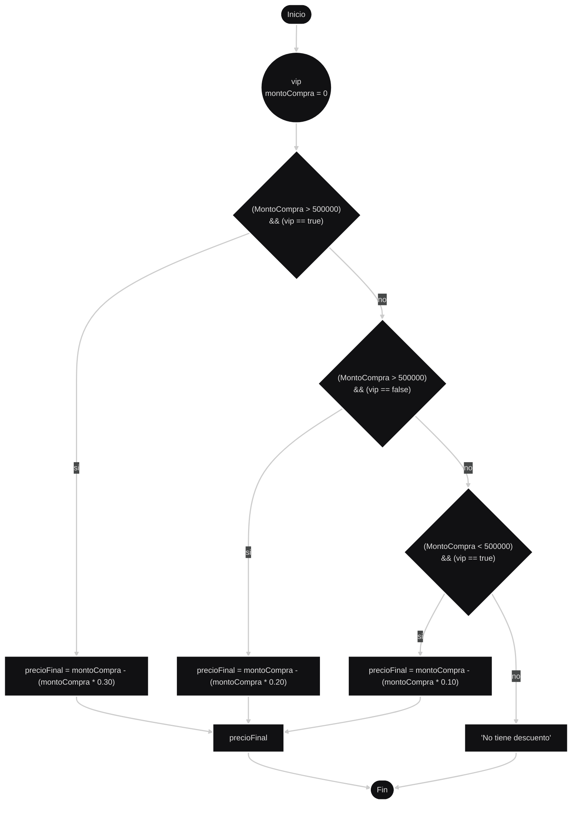

## 🛠️ Solución Propuesta

```mermaid
---
config:
  theme: redux-dark
---
graph TD
    A([Inicio]) --> B((vip <br/> montoCompra = 0))

    B --> C{"(MontoCompra > 500000) <br/> && (vip == true)"}

    C -- si --> D["precioFinal = montoCompra - (montoCompra * 0.30)"]
    C -- no --> E{"(MontoCompra > 500000) <br/> && (vip == false)"}

    E -- si --> F["precioFinal = montoCompra - (montoCompra * 0.20)"]
    E -- no --> G{"(MontoCompra < 500000) <br/> && (vip == true)"}

    G -- si --> H["precioFinal = montoCompra - (montoCompra * 0.10)"]
    G -- no --> I["'No tiene descuento'"]

    D --> J[precioFinal]
    F --> J
    H --> J

    J --> K([Fin])
    I --> K
```
