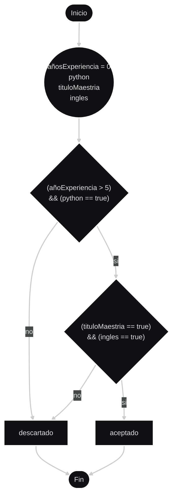

## 🛠️ Solución Propuesta

```mermaid
---
config:
  theme: redux-dark
---
graph TD
    A([Inicio]) --> B((añosExperiencia = 0 <br/> python <br/> tituloMaestria <br/> ingles))

    B --> C{"(añoExperiencia > 5) <br/> && (python == true)"}

    C -- no --> D[descartado]
    C -- si --> E{"(tituloMaestria == true) <br/> && (ingles == true)"}

    E -- no --> D
    E -- si --> F[aceptado]

    D --> G([Fin])
    F --> G
```
