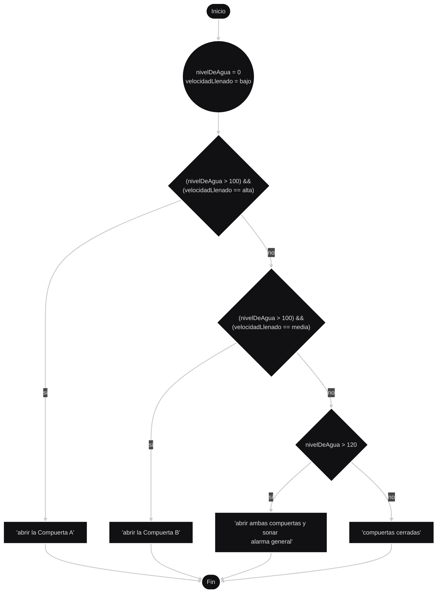

## 🛠️ Solución Propuesta

```mermaid
---
config:
  theme: redux-dark
---
graph TD
    A([Inicio]) --> B((nivelDeAgua = 0 <br/> velocidadLlenado = bajo))

    B --> C{"(nivelDeAgua > 100) && <br/> (velocidadLlenado == alta)"}

    C -- si --> D["'abrir la Compuerta A'"]
    C -- no --> E{"(nivelDeAgua > 100) && <br/> (velocidadLlenado == media)"}

    E -- si --> F["'abrir la Compuerta B'"]
    E -- no --> G{nivelDeAgua > 120}

    G -- si --> H["'abrir ambas compuertas y sonar <br/> alarma general'"]
    G -- no --> I["'compuertas cerradas'"]

    D --> J([Fin])
    F --> J
    H --> J
    I --> J
```
