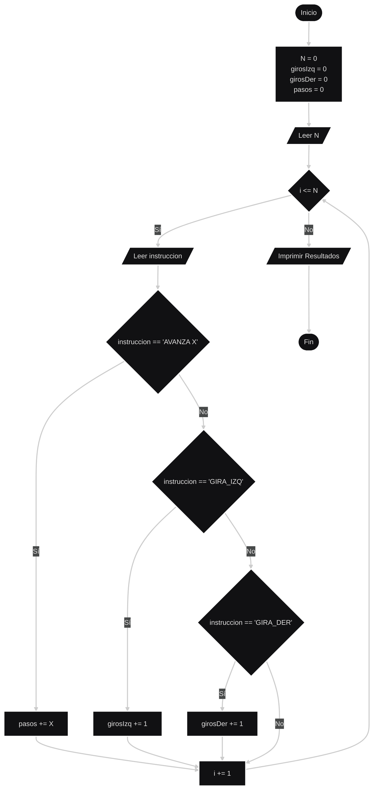

```mermaid
---
config:
  theme: redux-dark
  layout: dagre
---
graph TD
    A([Inicio]) --> B[N = 0<br/>girosIzq = 0<br/>girosDer = 0<br/>pasos = 0]
    B --> C[/Leer N/]
    C --> D{i <= N}

    D -- Sí --> E[/Leer instruccion/]
    E --> F{instruccion == 'AVANZA X'}

    F -- Sí --> G[pasos += X]
    F -- No --> H{instruccion == 'GIRA_IZQ'}

    H -- Sí --> I[girosIzq += 1]
    H -- No --> J{instruccion == 'GIRA_DER'}

    J -- Sí --> K[girosDer += 1]
    J -- No --> L[i += 1]

    G --> L
    I --> L
    K --> L

    L --> D

    D -- No --> M[/Imprimir Resultados/]
    M --> N([Fin])
```
