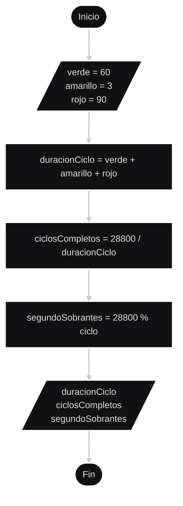

```mermaid
---
config:
  theme: redux-dark
  layout: dagre
---
graph TD
    A([Inicio]) --> B[/verde = 60 <br/> amarillo = 3 <br/> rojo = 90/]

    B --> C["duracionCiclo = verde + amarillo + rojo"]

    C --> D["ciclosCompletos = 28800 / duracionCiclo"]

    D --> E["segundoSobrantes = 28800 % ciclo"]

    E --> F[/duracionCiclo <br/> ciclosCompletos <br/> segundoSobrantes/]

    F --> G([Fin])
```
