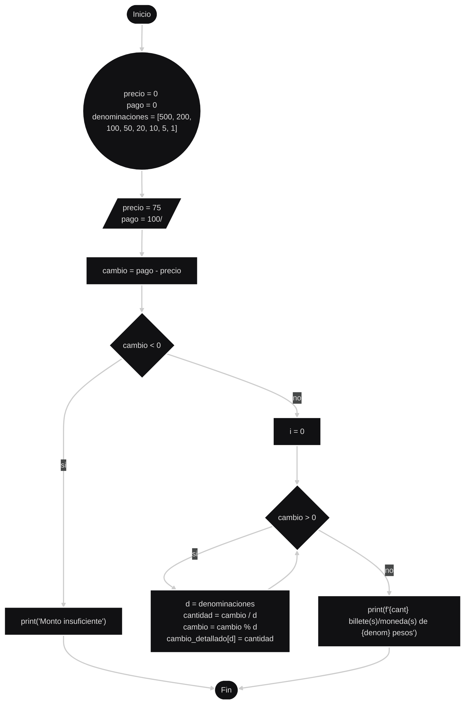

```mermaid
---
config:
  theme: redux-dark
  layout: dagre
---
graph TD
    A([Inicio]) --> B(("precio = 0 <br/> pago = 0 <br/> denominaciones = [500, 200, 100, 50, 20, 10, 5, 1]"))

    B --> C[/precio = 75 <br/> pago = 100//]

    C --> D["cambio = pago - precio"]

    D --> E{cambio < 0}

    E -- si --> F["print('Monto insuficiente')"]
    F --> G([Fin])

    E -- no --> H["i = 0"]

    H --> I{cambio > 0}

    I -- si --> J["d = denominaciones <br/> cantidad = cambio / d <br/> cambio = cambio % d <br/> cambio_detallado[d] = cantidad"]
    J --> I

    I -- no --> K["print(f'{cant} billete(s)/moneda(s) de {denom} pesos')"]
    K --> G
```
