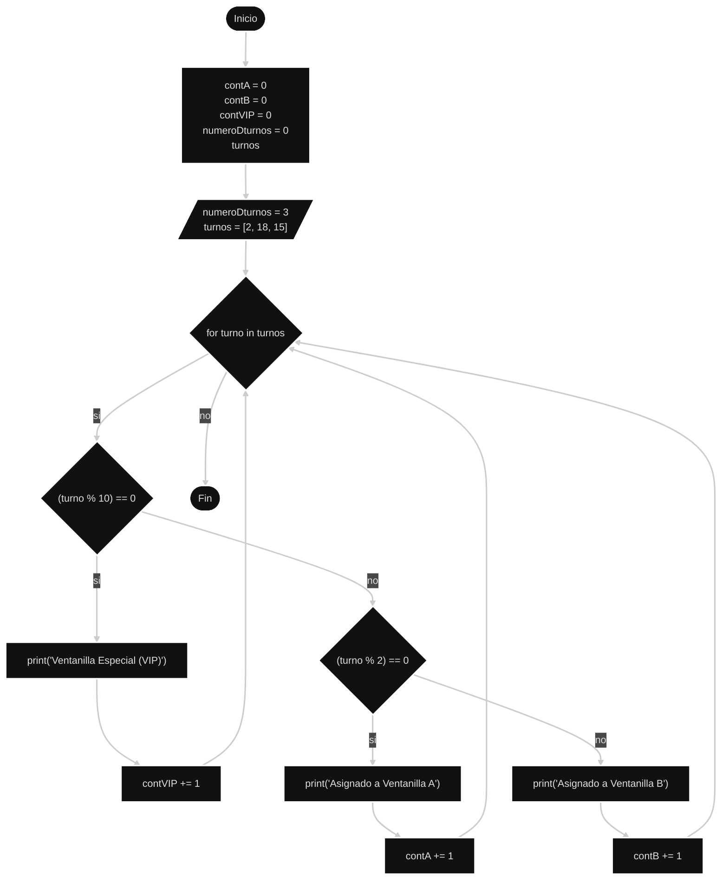

```mermaid
---
config:
  theme: redux-dark
  layout: dagre
---

graph TD
A([Inicio]) --> B["contA = 0 <br/> contB = 0 <br/> contVIP = 0 <br/> numeroDturnos = 0 <br/> turnos"]
B --> C[/"numeroDturnos = 3 <br/> turnos = [2, 18, 15]"/]

    C --> D{"for turno in turnos"}

    D -- si --> E{"(turno % 10) == 0"}
    D -- no --> F([Fin])

    E -- si --> G["print('Ventanilla Especial (VIP)')"]
    G --> H["contVIP += 1"]

    E -- no --> I{"(turno % 2) == 0"}

    I -- si --> J["print('Asignado a Ventanilla A')"]
    J --> K["contA += 1"]

    I -- no --> L["print('Asignado a Ventanilla B')"]
    L --> M["contB += 1"]

    H --> D
    K --> D
    M --> D
```
