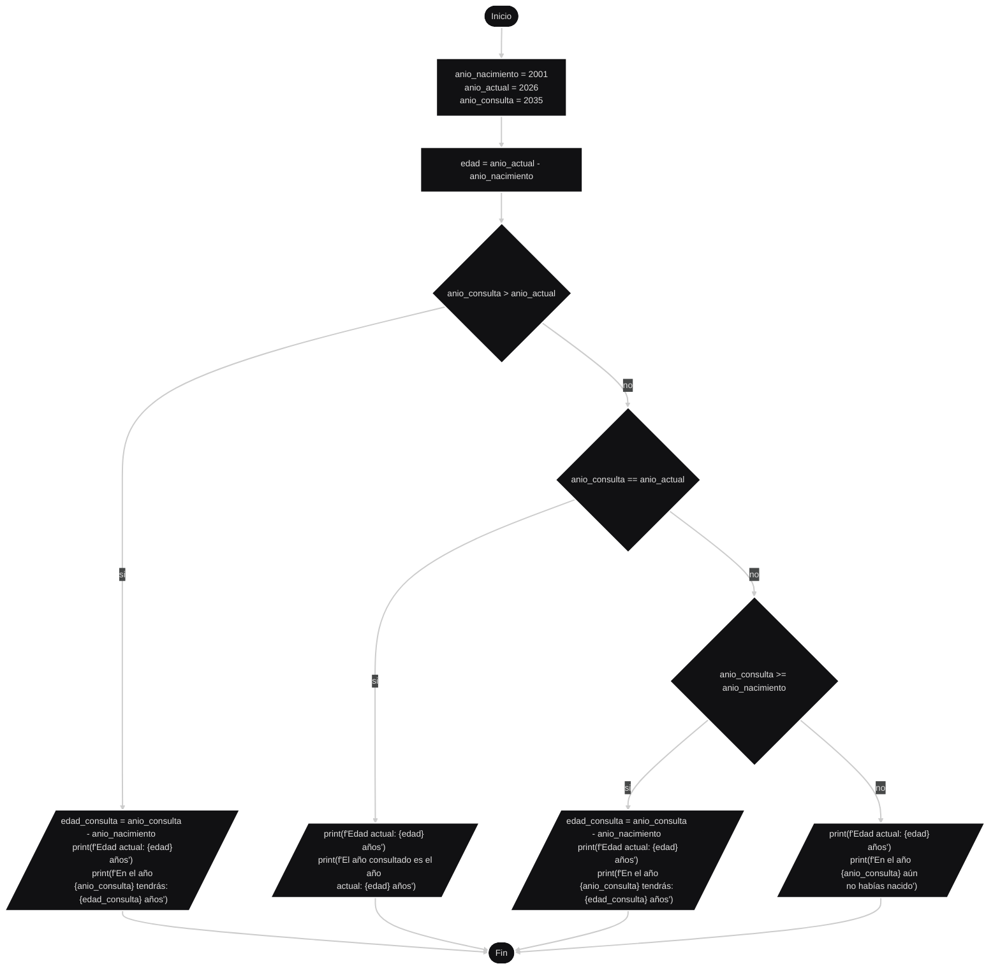

```mermaid
---
config:
  theme: redux-dark
  layout: dagre
---
graph TD

    A([Inicio]) --> B["anio_nacimiento = 2001 <br/> anio_actual = 2026 <br/> anio_consulta = 2035"]

    B --> C["edad = anio_actual - anio_nacimiento"]

    C --> D{anio_consulta > anio_actual}

    D -- si --> E[/"edad_consulta = anio_consulta - anio_nacimiento <br/> print(f'Edad actual: {edad} años') <br/> print(f'En el año {anio_consulta} tendrás: <br/> {edad_consulta} años')"/]

    D -- no --> F{anio_consulta == anio_actual}

    F -- si --> G[/"print(f'Edad actual: {edad} años') <br/> print(f'El año consultado es el año <br/> actual: {edad} años')"/]

    F -- no --> H{anio_consulta >= anio_nacimiento}

    H -- si --> I[/"edad_consulta = anio_consulta - anio_nacimiento <br/> print(f'Edad actual: {edad} años') <br/> print(f'En el año {anio_consulta} tendrás: <br/> {edad_consulta} años')"/]

    H -- no --> J[/"print(f'Edad actual: {edad} años') <br/> print(f'En el año {anio_consulta} aún <br/> no habías nacido')"/]

    E --> K([Fin])
    G --> K
    I --> K
    J --> K
```
