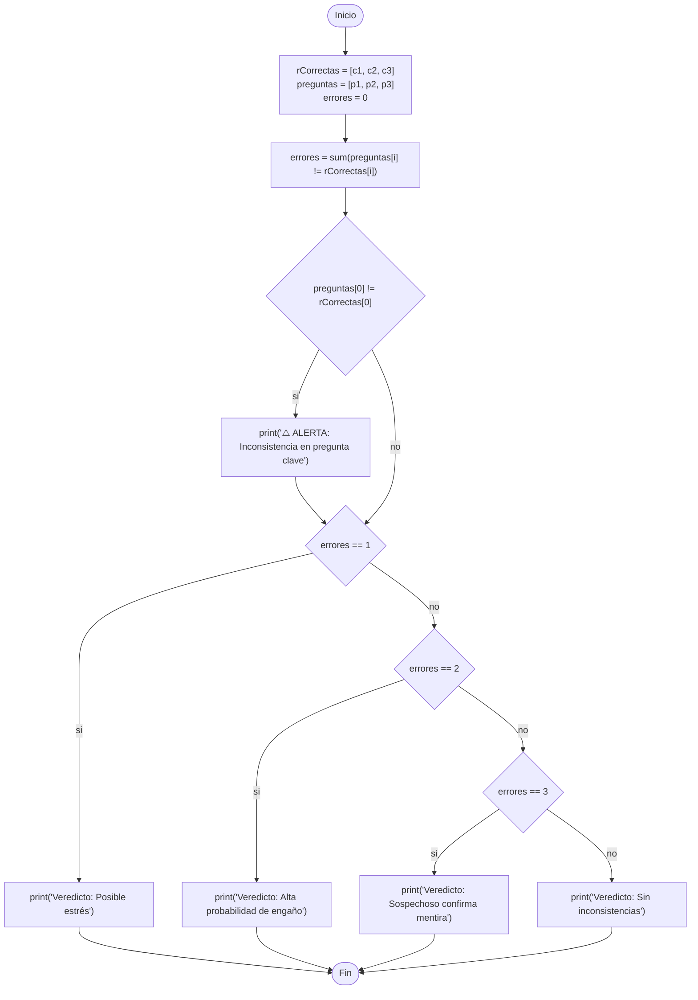

```mermaid
flowchart TB
A(["Inicio"]) --> B["rCorrectas = [c1, c2, c3] <br>preguntas = [p1, p2, p3] <br> errores = 0"]
B --> C["errores = sum(preguntas[i] != rCorrectas[i])"]
C --> D{"preguntas[0] != rCorrectas[0]"}
D -- si --> E@{ label: "print('⚠️ ALERTA: Inconsistencia en pregunta clave')" }
E --> F{"errores == 1"}
D -- no --> F
F -- si --> G@{ label: "print('Veredicto: Posible estrés')" }
F -- no --> H{"errores == 2"}
H -- si --> I@{ label: "print('Veredicto: Alta probabilidad de engaño')" }
H -- no --> J{"errores == 3"}
J -- si --> K@{ label: "print('Veredicto: Sospechoso confirma mentira')" }
J -- no --> L@{ label: "print('Veredicto: Sin inconsistencias')" }
G --> M(["Fin"])
I --> M
K --> M
L --> M

    E@{ shape: rect}
    G@{ shape: rect}
    I@{ shape: rect}
    K@{ shape: rect}
    L@{ shape: rect}
```
