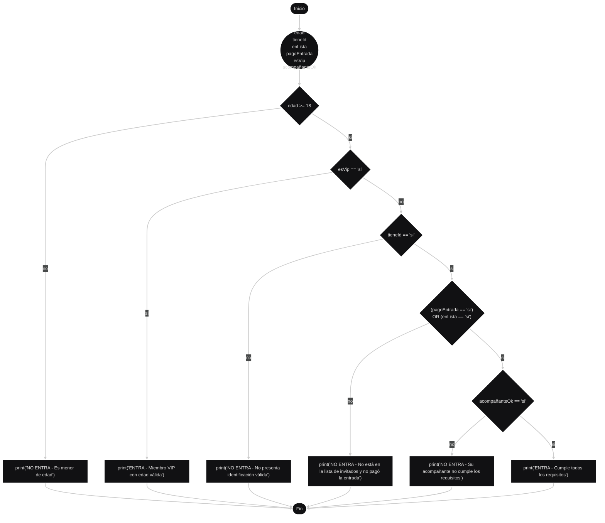

```mermaid
---
config:
  theme: redux-dark
  layout: dagre
---
graph TD
    A([Inicio]) --> B((edad <br/> tieneId <br/> enLista <br/> pagoEntrada <br/> esVip <br/> acompañanteOk))

    B --> C{edad >= 18}

    C -- no --> D["print('NO ENTRA - Es menor de edad')"]
    C -- si --> E{esVip == 'si'}

    E -- si --> F["print('ENTRA - Miembro VIP con edad válida')"]
    E -- no --> G{tieneId == 'si'}

    G -- no --> H["print('NO ENTRA - No presenta identificación válida')"]
    G -- si --> I{"(pagoEntrada == 'si') <br/> OR (enLista == 'si')"}

    I -- no --> J["print('NO ENTRA - No está en la lista de invitados y no pagó la entrada')"]
    I -- si --> K{acompañanteOk == 'si'}

    K -- no --> L["print('NO ENTRA - Su acompañante no cumple los requisitos')"]
    K -- si --> M["print('ENTRA - Cumple todos los requisitos')"]

    D --> N([Fin])
    F --> N
    H --> N
    J --> N
    L --> N
    M --> N
```
