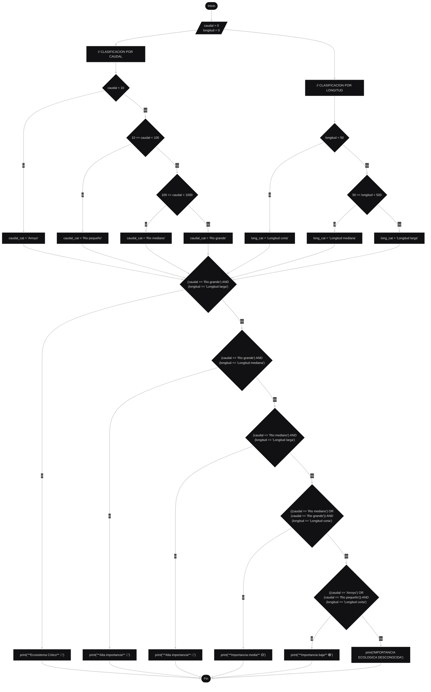

```mermaid
---
config:
  theme: redux-dark
  layout: dagre
---
graph TD
    A([Inicio]) --> B[/caudal = 0 <br/> longitud = 0/]

    %% RAMA IZQUIERDA: CAUDAL
    B --> C1["// CLASIFICACION POR CAUDAL"]
    C1 --> C2{caudal < 10}
    C2 -- si --> C2s["caudal_cat = 'Arroyo'"]
    C2 -- no --> C3{10 <= caudal < 100}
    C3 -- si --> C3s["caudal_cat = 'Rio pequeño'"]
    C3 -- no --> C4{100 <= caudal < 1000}
    C4 -- si --> C4s["caudal_cat = 'Rio mediano'"]
    C4 -- no --> C5["caudal_cat = 'Rio grande'"]

    %% RAMA DERECHA: LONGITUD
    B --> L1["// CLASIFICACION POR LONGITUD"]
    L1 --> L2{longitud < 50}
    L2 -- si --> L2s["long_cat = 'Longitud corta'"]
    L2 -- no --> L3{50 <= longitud < 500}
    L3 -- si --> L3s["long_cat = 'Longitud mediana'"]
    L3 -- no --> L4["long_cat = 'Longitud larga'"]

    %% UNIFICACIÓN Y EVALUACIÓN DE ECOSISTEMA
    C2s & C3s & C4s & C5 & L2s & L3s & L4 --> D{"(caudal == 'Rio grande') AND <br/> (longitud == 'Longitud larga')"}

    D -- si --> Ds["print('**Ecosistema Critico** 🔴')"]
    D -- no --> E{"(caudal == 'Rio grande') AND <br/> (longitud == 'Longitud mediana')"}

    E -- si --> Es["print('**Alta importancia** 🔴')"]
    E -- no --> F{"(caudal == 'Rio mediano') AND <br/> (longitud == 'Longitud larga')"}

    F -- si --> Fs["print('**Alta importancia** 🔴')"]
    F -- no --> G{"((caudal == 'Rio mediano') OR <br/> (caudal == 'Rio grande')) AND <br/> (longitud == 'Longitud corta')"}

    G -- si --> Gs["print('**Importancia media** 🟡')"]
    G -- no --> H{"((caudal == 'Arroyo') OR <br/> (caudal == 'Rio pequeño')) AND <br/> (longitud == 'Longitud corta')"}

    H -- si --> Hs["print('**Importancia baja** 🟢')"]
    H -- no --> I["print('IMPORTANCIA ECOLOGICA DESCONOCIDA')"]

    Ds & Es & Fs & Gs & Hs & I --> Z([Fin])
```
