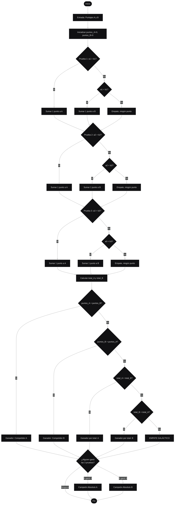

```mermaid
---
config:
  theme: redux-dark
  layout: dagre
---
flowchart TD
    A([Inicio]) --> B[Entrada: Puntajes A y B]
    B --> C[Inicializar puntos_A=0, puntos_B=0]

    %% Prueba 1
    C --> D{Prueba 1: a1 > b1?}
    D -->|Sí| D1[Sumar 1 punto a A]
    D -->|No| D2{a1 < b1?}
    D2 -->|Sí| D3[Sumar 1 punto a B]
    D2 -->|No| D4[Empate, ningún punto]

    %% Prueba 2
    D1 & D3 & D4 --> E{Prueba 2: a2 > b2?}
    E -->|Sí| E1[Sumar 1 punto a A]
    E -->|No| E2{a2 < b2?}
    E2 -->|Sí| E3[Sumar 1 punto a B]
    E2 -->|No| E4[Empate, ningún punto]

    %% Prueba 3
    E1 & E3 & E4 --> F{Prueba 3: a3 > b3?}
    F -->|Sí| F1[Sumar 1 punto a A]
    F -->|No| F2{a3 < b3?}
    F2 -->|Sí| F3[Sumar 1 punto a B]
    F2 -->|No| F4[Empate, ningún punto]

    %% Cálculos Finales
    F1 & F3 & F4 --> G[Calcular total_A y total_B]
    G --> H{puntos_A > puntos_B?}

    %% Decisiones de Ganador
    H -->|Sí| H1[Ganador: Competidor A]
    H -->|No| H2{puntos_B > puntos_A?}
    H2 -->|Sí| H3[Ganador: Competidor B]
    H2 -->|No| H4{total_A > total_B?}

    H4 -->|Sí| H5[Ganador por total: A]
    H4 -->|No| H6{total_B > total_A?}
    H6 -->|Sí| H7[Ganador por total: B]
    H6 -->|No| H8[EMPATE GALÁCTICO]

    %% Campeón Absoluto
    H1 & H3 & H5 & H7 & H8 --> I{¿Alguien ganó <br/> las 3 pruebas?}
    I -->|A ganó 3| I1[Campeón Absoluto A]
    I -->|B ganó 3| I2[Campeón Absoluto B]
    I -->|Ninguno| J([Fin])

    I1 & I2 --> J
```
