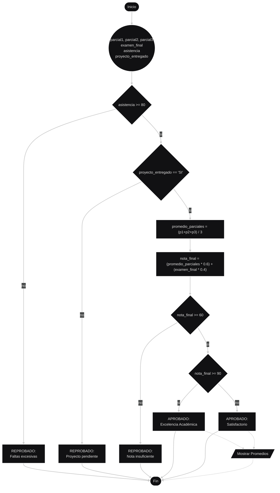

```mermaid
---
config:
  theme: redux-dark
  layout: dagre
---
graph TD
    A([Inicio]) --> B((parcial1, parcial2, parcial3 <br/> examen_final <br/> asistencia <br/> proyecto_entregado))

    B --> C{asistencia >= 80}

    C -- no --> D["REPROBADO: <br/> Faltas excesivas"]
    C -- si --> E{proyecto_entregado == 'SI'}

    E -- no --> F["REPROBADO: <br/> Proyecto pendiente"]
    E -- si --> G["promedio_parciales = (p1+p2+p3) / 3"]

    G --> H["nota_final = (promedio_parciales * 0.6) + (examen_final * 0.4)"]

    H --> I{nota_final >= 60}

    I -- no --> J["REPROBADO: <br/> Nota insuficiente"]
    I -- si --> K{nota_final >= 90}

    K -- si --> L["APROBADO: <br/> Excelencia Académica"]
    K -- no --> M["APROBADO: <br/> Satisfactorio"]

    D & F & J & L & M --> Z([Fin])

    %% Mostrar promedios solo si aprobó
    L -.-> P[/Mostrar Promedios/]
    M -.-> P
    P -.-> Z
```
