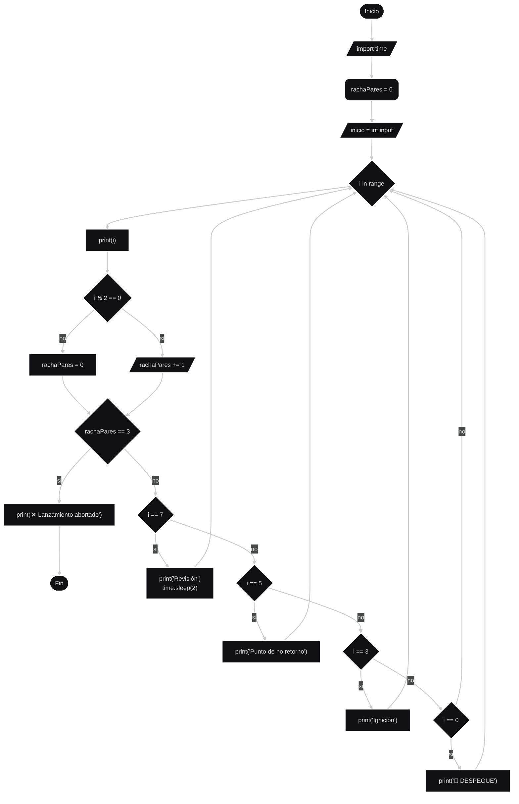

```mermaid
---
config:
  theme: redux-dark
  layout: dagre
---
flowchart TD
    A([Inicio]) --> B[/import time/]
    B --> C("rachaPares = 0")
    C --> D[/inicio = int input/]
    D --> E{"i in range"}

    E --> F["print(i)"]
    G_DECISION{"i % 2 == 0"}
    F --> G_DECISION

    G_DECISION -- no --> H["rachaPares = 0"]
    G_DECISION -- si --> I[/"rachaPares += 1"/]

    H --> J{"rachaPares == 3"}
    I --> J

    J -- si --> K["print('❌ Lanzamiento abortado')"]
    K --> L([Fin])

    J -- no --> M{"i == 7"}
    M -- si --> N["print('Revisión') <br/> time.sleep(2)"]
    M -- no --> O{"i == 5"}

    O -- si --> P["print('Punto de no retorno')"]
    O -- no --> Q{"i == 3"}

    Q -- si --> R["print('Ignición')"]
    Q -- no --> S{"i == 0"}

    S -- si --> T["print('🚀 DESPEGUE')"]
    S -- no --> E

    N --> E
    P --> E
    R --> E
    T --> E
```
